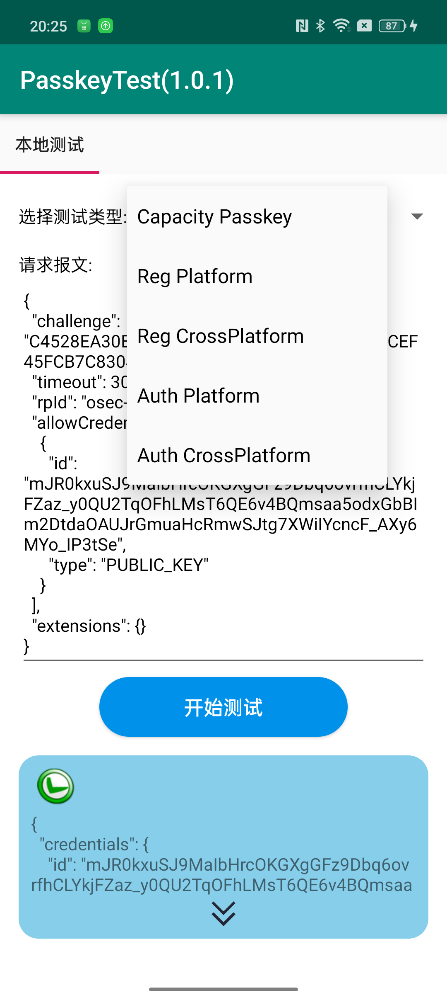

# PasskeySDK-Demo

## 简介
PasskeySDK-Demo通过展示给开发者如何使用PasskeySDK提供的API进行开发，展示的范例涵盖了注册、认证、认证器能力检测的使用方法。

## 数字资产鉴权
这个Demo使用的依赖方ID（RpId）为 osec-fido-cn-test.wanyol.com，因此根据SDK接入文档的介绍，我们在 [https://osec-fido-cn-test.wanyol.com/.well-known/fido2-trusted-facets.json](https://osec-fido-cn-test.wanyol.com/.well-known/fido2-trusted-facets.json) 地址配置了这个应用的数字资产证明。

## 功能说明
通过右上角的下拉菜单，选择测试类型：

* Capacity Passkey：检测认证器是否具有Passkey注册、认证的能力
* Reg Platform：注册Passkey，使用本地认证器的方式（internal）
* Reg CrossPlatform：注册Passkey，使用外部认证器的方式（hybrid，nfc，ble，usb）
* Auth Platform：使用Passkey进行认证，allowCredentials 使用上一次Reg Platform注册的CredentialId。
* Auth CrossPlatform：使用Passkey进行认证，allowCredentials 使用上一次Reg CrossPlatform注册的CredentialId

选择测试类型后，编辑框中对应的请求报文可以手动编辑修改，以测试不同报文下认证器的行为差异。点击开始测试，返回的结果绿色图标代表成功，红色图标代表失败。

## Authors:
 - 李阳 (liyang123456@oppo.com)

